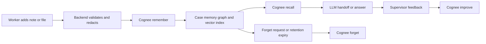

# Cognee Memory Architecture

## Architecture Thesis

Cognee is the durable memory boundary for ShiftMemory. The application database stores product state, permissions, audit metadata, and workflow status. Cognee stores and retrieves the case memory used by agents.

The LLM does not browse the entire app database. The backend asks Cognee for authorized memory, then passes a bounded context package to the LLM.

## Why Cognee Is the Correct Core

The hackathon asks for AI that does not forget. Cognee is designed for this exact role:

- It turns raw data into searchable memory.
- It combines vector search with graph relationships.
- It supports `remember`, `recall`, `improve`, and `forget`.
- Its architecture separates provenance, semantic retrieval, and structured relationships.

For ShiftMemory, this means a shift note can become more than text. It becomes a memory object connected to people, tasks, risks, dates, documents, and prior decisions.

## Memory Lifecycle



## Memory Scopes

Use one Cognee dataset per remembered item for the hackathon MVP, grouped by a case prefix.

This is intentionally simple for reviewer clarity: when a note is forgotten, the app can call Cognee forget for that note's dataset and prove the note stops participating in future recall.

Dataset naming:

```text
handoff-demo-{case_id}-{memory_id}
```

Examples:

```text
handoff-demo-resident-avery-mem-family-9am
handoff-demo-resident-avery-mem-oatmeal-breakfast
```

Rationale:

- Makes item-level forget easy to prove during judging.
- Keeps case isolation clear because every dataset name includes the case ID.
- Keeps the proof screen understandable because every Cognee call shows the exact dataset it touched.
- Makes memory traces understandable in the demo.

Future option:

- One dataset per case or org with strong metadata filters can reduce dataset sprawl, but it creates more risk for a short hackathon MVP. We should migrate there after the demo once item-level deletion semantics are verified.

## Memory Metadata

Every remembered item gets app metadata before being sent to Cognee.

```json
{
  "org_id": "demo-care",
  "case_id": "resident-avery",
  "memory_id": "mem_01J...",
  "source_type": "shift_note",
  "source_id": "note_01J...",
  "shift_id": "shift_night_2026_07_04",
  "actor_id": "user_01J...",
  "actor_role": "caregiver",
  "visibility": "case_team",
  "risk_level": "routine",
  "created_at": "2026-07-04T23:30:00Z",
  "retention_until": "2026-10-04T00:00:00Z",
  "pii_classification": "synthetic_demo",
  "source_hash": "sha256:..."
}
```

## What Goes Into Cognee

### Remembered Permanently

- shift notes;
- uploaded handoff docs;
- incident summaries;
- task updates;
- supervisor decisions;
- user corrections;
- important family or preference context in demo data;
- generated handoff summaries after human confirmation.

### Session Memory

- a user's current conversation with the assistant;
- draft questions;
- temporary context before supervisor confirmation.

### Not Remembered

- raw authentication tokens;
- passwords;
- payment data;
- secrets;
- debugging payloads;
- unreviewed prompt text from attackers;
- real PHI in hackathon demo.

## Operation Design

### `remember`

Triggered by:

- `POST /v1/cases/{case_id}/notes`
- `POST /v1/cases/{case_id}/files`
- `POST /v1/cases/{case_id}/handoffs/{handoff_id}/confirm`
- `POST /v1/cases/{case_id}/events`

Backend responsibilities:

- authenticate user;
- authorize org and case access;
- validate payload;
- classify and optionally redact sensitive content;
- generate source ID and idempotency key;
- call Cognee with dataset and metadata;
- store memory operation record in app DB.

### `recall`

Triggered by:

- `POST /v1/cases/{case_id}/handoff`
- `POST /v1/cases/{case_id}/ask`
- `GET /v1/cases/{case_id}/timeline`
- technical proof trace view.

Recall patterns:

- "What changed since last shift?"
- "What risks are currently open?"
- "What tasks need follow-up?"
- "What did the previous worker say about this issue?"
- "Which documents support this answer?"

The app should let Cognee handle routing between semantic search, graph traversal, and hybrid retrieval wherever available. We should not hard-code a naive top-k list as the product brain. We can set guardrails, query intent, dataset scope, and result budgets, but Cognee should be responsible for memory retrieval depth.

### `improve`

Triggered by:

- supervisor marks a generated handoff as useful;
- supervisor marks a note as important;
- user corrects an answer;
- user resolves a task;
- feedback indicates a recalled source was irrelevant.

Backend responsibilities:

- audit the feedback event without turning reviewer wording into a worker-facing note;
- send enrichment or improvement signal to Cognee;
- optionally promote useful session memory into permanent case memory;
- keep a visible audit trail.

### `forget`

Triggered by:

- user removes an incorrect note;
- supervisor purges stale memory;
- retention expiry;
- case deletion;
- demo reset.

Backend responsibilities:

- authorize destructive action;
- tombstone app record;
- call Cognee forget for item, dataset, or user scope;
- remove object storage file if any;
- verify memory no longer appears in recall;
- log deletion audit event.

## Handoff Recall Strategy

For a generated handoff, the backend should execute several focused recall intents instead of one vague prompt:

1. Recent changes since last shift.
2. Open risks or incidents.
3. Pending tasks and ownership.
4. Relevant people, preferences, or family context.
5. Documents or prior decisions related to the current shift.
6. Conflicts or unknowns.

Cognee returns memory context. The LLM then creates a structured handoff from only the recalled context.

## Handoff Output Schema

```json
{
  "case_id": "resident-avery",
  "generated_at": "2026-07-04T23:55:00Z",
  "summary": "string",
  "changes": [
    {
      "text": "string",
      "source_ids": ["note_01J..."],
      "confidence": "high"
    }
  ],
  "risks": [],
  "tasks": [],
  "people_context": [],
  "unknowns": [],
  "source_refs": [],
  "safety_note": "This is a workflow handoff, not medical advice."
}
```

## Technical Proof Trace

The normal user interface should hide Cognee implementation details. The proof mode should show:

- operation type: remember, recall, improve, forget;
- dataset name;
- source IDs;
- recalled source snippets;
- latency;
- result count;
- whether graph, semantic, or hybrid retrieval was used if Cognee exposes it;
- downstream LLM provider;
- final output source coverage.

## Agent Integration

ShiftMemory should support multiple agent surfaces over the same memory:

- web dashboard assistant;
- supervisor review assistant;
- scheduled morning handoff job;
- Slack or Teams bot;
- n8n workflow;
- future voice assistant.

The product principle:

One memory layer, many agents.

## Failure Behavior

If Cognee recall fails:

- do not hallucinate a handoff;
- show a retryable error;
- allow manual notes view;
- log Cognee error code and request ID;
- alert if failure rate crosses SLO threshold.

If Cognee remember fails:

- keep the note in pending-memory state;
- show "saved locally, memory indexing pending";
- retry asynchronously;
- do not claim it is available for AI handoff until indexing succeeds.

If Cognee forget fails:

- mark deletion as pending;
- prevent the item from being used by the application layer;
- alert immediately;
- retry until verified.
