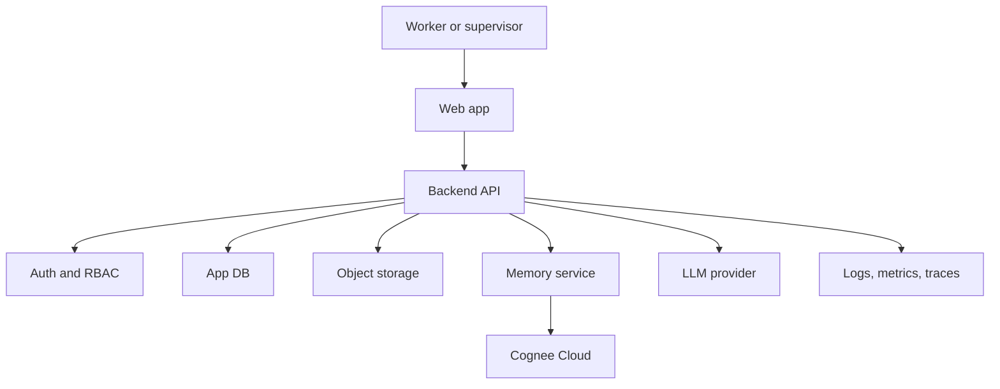
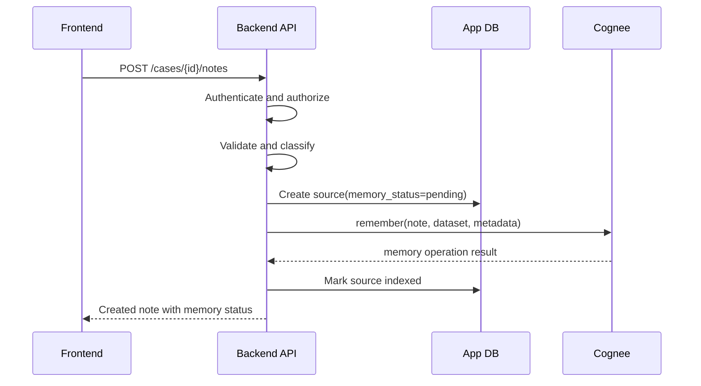
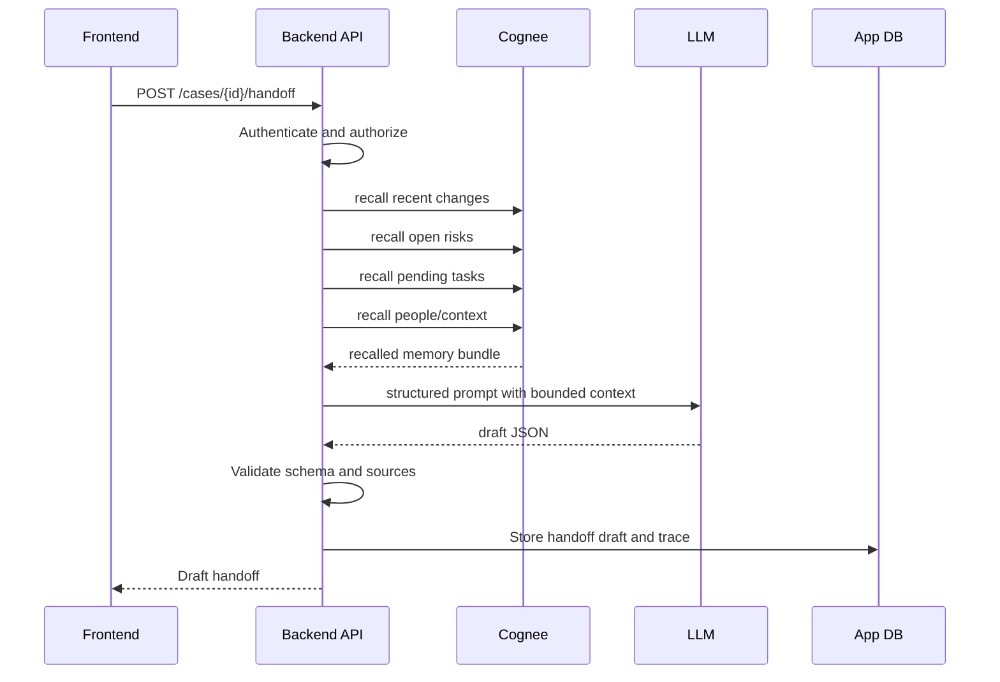

# System Architecture

## Architecture Summary

ShiftMemory is a web app with a backend-controlled memory service. The frontend never talks directly to Cognee or the LLM. The backend authenticates the user, authorizes the case, calls Cognee, calls the LLM, validates output, and stores audit records.

## Recommended MVP Stack

Frontend:

- React or Next.js.
- Case dashboard, note composer, handoff view, Q&A view, judge trace view.

Backend:

- FastAPI or Node/Express.
- Strong preference: FastAPI if using Cognee Python SDK.

App database:

- PostgreSQL for production path.
- SQLite is acceptable for local-only demo, but Postgres is preferred for a serious MVP.

Memory:

- Cognee Cloud for hackathon submission.
- Self-hosted Cognee as future enterprise option.

Object storage:

- Local filesystem for demo or S3-compatible storage for deployed MVP.

Queue:

- Redis-backed queue for ingestion, retries, and handoff generation if time allows.
- Inline calls are acceptable for hackathon MVP if tracked and time-boxed.

Observability:

- structured logs;
- request IDs;
- memory operation IDs;
- basic metrics endpoint;
- simple admin trace page.

## Core Backend Modules

### Auth Service

Responsibilities:

- login/session management;
- user identity;
- org membership;
- role checks.

### Case Service

Responsibilities:

- case creation;
- team membership;
- case metadata;
- shift window tracking.

### Memory Service

Responsibilities:

- create Cognee datasets;
- call remember, recall, improve, forget;
- enforce dataset naming rules;
- log memory operation records;
- map Cognee errors to app errors.

### Handoff Service

Responsibilities:

- gather recall intents;
- call Memory Service;
- call LLM provider;
- validate output;
- store generated handoff;
- support supervisor confirmation.

### Agent Service

Responsibilities:

- Q&A;
- supervisor review;
- future external agent integrations.

### Audit Service

Responsibilities:

- immutable event log;
- deletion requests;
- generated output trace;
- admin export for demo and debugging.

### Rate Limit Service

Responsibilities:

- per-user and per-org limits;
- Cognee balance guard;
- LLM token budget;
- abuse prevention.

## Data Ownership

App DB owns:

- users;
- orgs;
- roles;
- cases;
- source records;
- handoff records;
- audit logs;
- memory operation logs;
- retention policies.

Cognee owns:

- durable memory graph;
- vector index;
- recalled memory results;
- enrichment state.

Object storage owns:

- uploaded source files;
- generated exports;
- optional demo artifacts.

## App DB Tables

### users

- id
- email
- display_name
- created_at
- status

### orgs

- id
- name
- plan
- created_at

### memberships

- user_id
- org_id
- role

### cases

- id
- org_id
- display_name
- status
- cognee_dataset
- created_at

### sources

- id
- org_id
- case_id
- source_type
- title
- content_hash
- object_uri
- memory_status
- created_by
- created_at
- deleted_at

### memory_operations

- id
- org_id
- case_id
- source_id
- operation
- cognee_dataset
- cognee_request_id
- status
- latency_ms
- error_code
- created_at

### handoffs

- id
- org_id
- case_id
- shift_id
- status
- output_json
- source_ids
- generated_by
- confirmed_by
- created_at
- confirmed_at

### audit_events

- id
- org_id
- actor_id
- action
- target_type
- target_id
- request_id
- metadata_json
- created_at

## Request Flow: Add Note

## Request Flow: Generate Handoff

## Deployment Environments

### Local

- local frontend;
- local backend;
- Cognee Cloud remote;
- local SQLite or Postgres;
- synthetic demo data.

### Hackathon Demo

- hosted frontend;
- hosted backend;
- Cognee Cloud;
- managed Postgres or local persistence if demo host is simple;
- secrets in deployment environment variables.

### Future Production

- separate frontend and API deployments;
- managed Postgres;
- Cognee Cloud or self-hosted Cognee;
- object storage;
- queue worker;
- monitoring and alerting;
- private network where possible.

## Scalability Plan

MVP scale target:

- 1 to 5 demo orgs;
- 10 to 100 cases;
- hundreds of notes;
- handoff latency under 8 seconds p95.

Next scale target:

- async ingestion workers;
- result caching;
- batch file ingestion;
- queue backpressure;
- separate read/write API paths;
- Cognee backend tuned with production vector and graph stores.

## Key Engineering Decisions

1. Use Cognee Cloud for hackathon credibility and managed reliability.
2. Keep Cognee API keys on the backend only.
3. Use one Cognee dataset per case for MVP isolation.
4. Require source references in every generated handoff.
5. Add judge trace mode to prove memory lifecycle usage.
6. Treat file and note content as untrusted data.
7. Build deletion and retention before public demo.
